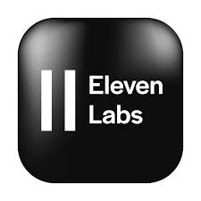

<p>
  <div align="right"> 
<a href="./readme.md"> </a><a href="./leiame.md">  </a>
</div>
  <H1><b> Victor Sérgio Silva Barros </b> </H1>
  
</p> 





# Curso Criando Podcast Gerado por I.A.s

Este repositório contém materiais desenvolvido durante o curso Projeto Podcast Gerado por I.A.s

## Descrição

Projeto com o objetivo de gerar um podcast utilizando ferramentas de IA através de prompts mais trabalhado.

Utilizer uma esteira de prompts para gerar cada etapa do processo criativo.

## Tecnologias utilizadas no projeto
- [ChatGPT](https://chat.openai.com/) 
- [MidJourney](https://www.midjourney.com/app/)
- [ElevenLabs](https://beta.elevenlabs.io/)
- [Capcut](https://www.capcut.com/pt-br/)

## ✨ Como foi feito ?

- Roteiro gerado via chatgpt
- Audio gerado pela elevenLabs
- Midjourney Para gerar capas
- Capcut para tratar aúdio e adicionar sons de fundo

## Podcast

<a href="./outputs/Podcast.mp3" download>Ouça o podcast completo</a>


## ebook

[MESTRE DA CORRENTE - DOMINE OHM E RESISTORES NA PRÁTICA](./ebook%20MESTRE%20DA%20CORRENTE%20-%20DOMINE%20OHM%20E%20RESISTORES%20NA%20PR%C3%81TICA.pdf)


## Licença

Este projeto está licenciado sob a Licença MIT. Consulte o arquivo [LICENSE](LICENSE) para mais informações.

## Versioning
 
1.0.0
 
 
## Author
 
* **Victor Sérgio Silva Barros**: 


<p align="left">
  <a href="mailto:vicssb@gmail.com" alt="Gmail" target = "_blank">
  </a>

  <a href="https://www.linkedin.com/in/victor-sergio-silva-barros/" alt="Linkedin" target = "_blank">
  </a>

  <a href="https://wa.me/+5512981328278" alt="WhatsApp" target = "_blank">
  </a>

  </p>  

<p>Por favor, siga o github e junte-se a nós!
Obrigado pela visita e boa codificação!</p>
````


